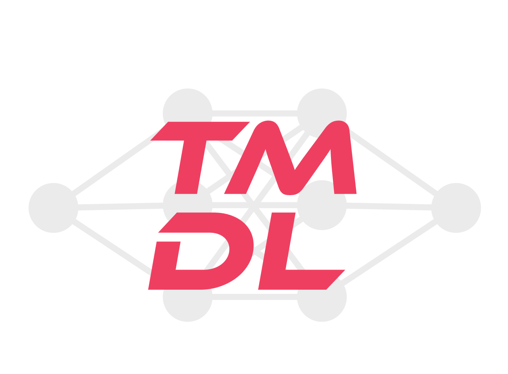

# Timisoara Deep Learning Meetup
## Intro

**Timisoara Deep Learning Meetup** 

If you want to attend our meetups, please sign up [here](https://www.meetup.com/Timisoara-Deep-Learning-Meetup/). 

## Links & Resources

* Meetup page: https://www.meetup.com/Timisoara-Deep-Learning-Meetup/
* Facebook group: https://www.facebook.com/groups/1245735832114598/

## Meetups

| M#    | Date | Venue | Topic | Resources | Meetup.com | FB event |
| ---- | ---- | ----- | ----- | --------- | ---------- | -------- |
| M30   | 2020-06-25 | Zoom | Deploying your neural network in the cloud. How to scale your model. | [content](./Meetups/Meetup_30/)  | [link](https://www.meetup.com/Timisoara-Deep-Learning-Meetup/events/271203774/)  | |
| M29   | 2020-05-29 | Zoom | Natural Language Processing: from word embeddings to transformers | [content](./Meetups/Meetup_29/)  | [link](https://www.meetup.com/Timisoara-Deep-Learning-Meetup/events/270504094/)  | |
| M28   | 2020-04-21 | Zoom | Visualization and Understanding of DNNs | [content](./Meetups/Meetup_28/)  | [link](https://www.meetup.com/Timisoara-Deep-Learning-Meetup/events/269991391/)  | |
| M27   | 2020-03-06 | Devplant Cowork | Towards an Argument Search Engine for the Web | [content](./Meetups/Meetup_27/)  | [link](https://www.meetup.com/Timisoara-Deep-Learning-Meetup/events/268238111/)  | |
| M26   | 2019-12-15 | Devplant Cowork | NeurIPS Workshop: Bayesian Deep Learning | [content](./Meetups/Meetup_26/)  | [link](https://www.meetup.com/Timisoara-Deep-Learning-Meetup/events/266733910/)  | |
| M25   | 2019-12-13 | Devplant Cowork | NeurIPS Tutorial: Deep Learning with Bayesian Principles | [content](./Meetups/Meetup_25/)  | [link](https://www.meetup.com/Timisoara-Deep-Learning-Meetup/events/266733844/)  | |
| M24   | 2019-12-12 | Devplant Cowork | NeurIPS Tutorial: Machine Learning for Computational Biology and Health | [content](./Meetups/Meetup_24/)  | [link](https://www.meetup.com/Timisoara-Deep-Learning-Meetup/events/266733794/)  | |
| M23   | 2019-12-11 | Devplant Cowork | NeurIPS Tutorial: Efficient Processing of Deep Neural Network | [content](./Meetups/Meetup_23/)  | [link](https://www.meetup.com/Timisoara-Deep-Learning-Meetup/events/266733644/)  | |
| M22   | 2019-09-07 | Ambasada | Machine Learning Applications in Healthcare | [content](./Meetups/Meetup_22/)  | [link](https://www.meetup.com/Timisoara-Deep-Learning-Meetup/events/264307164/)  | |
| M21   | 2019-05-27 | Cowork - The Garden | Introduction to Adversarial Robustness | [content](./Meetups/Meetup_21/)  | [link](https://www.meetup.com/Timisoara-Deep-Learning-Meetup/events/261575842/)  | |
| M20   | 2019-03-20 | Cowork - The Garden | Extreme Gradient Boosting & Creating your Recommender System using Embeddings | [content](./Meetups/Meetup_20/)  | [link](https://www.meetup.com/Timisoara-Deep-Learning-Meetup/events/259540661/)  | |
| M19   | 2019-02-23 | Amfiteatrul D1 Electro | Timisoara Machine Learning Workshop | [content](./Meetups/Meetup_19/) [event page](https://workshops.eeml.eu/previous-editions/tmlw-2019)  | [link](https://www.meetup.com/Timisoara-Deep-Learning-Meetup/events/258235891/)  | |
| M18   | 2019-01-22 | Devplant Cowork | OpenVINO & Neural Compute Stick 2 | [content](./Meetups/Meetup_18/)  | [link](https://www.meetup.com/Timisoara-Deep-Learning-Meetup/events/257868281/)  | |
| M17   | 2018-11-28 | Ness HQ, UBC 2 | YOLO: an algorithm for fast object detection | [content](./Meetups/Meetup_17/)  | [link](https://www.meetup.com/Timisoara-Deep-Learning-Meetup/events/256580210/)  | |
| M16   | 2018-10-13 | Startup Hub | Joint Face Detection and Alignment using Multi-task Cascaded CNNs | [content](./Meetups/Meetup_16/)  | [link](https://www.meetup.com/Timisoara-Deep-Learning-Meetup/events/255169240/)  | |
| M15   | 2018-10-10 | Cowork - Tineretului | fast.ai Live - Practical Deep Learning For Coders | [content](./Meetups/Meetup_15/)  | [link](https://www.meetup.com/Timisoara-Deep-Learning-Meetup/events/255231572/)  | |
| M14   | 2018-09-14 | Startup Hub | Meetup with Corina Gurau from Oxford Robotics Institute | [content](./Meetups/Meetup_14/)  | [link](https://www.meetup.com/Timisoara-Deep-Learning-Meetup/events/254608045/)  | |
| M13   | 2018-09-08 | Startup Hub | Building a CNN using IBM Watson | [content](./Meetups/Meetup_13/)  | [link](https://www.meetup.com/Timisoara-Deep-Learning-Meetup/events/253611369/)  | |
| M12   | 2018-06-21 | Startup Hub | "Zoom in, enhance!" in real-life : super-resolution with deep learning  | [content](./Meetups/Meetup_12/)  | [link](https://www.meetup.com/Timisoara-Deep-Learning-Meetup/events/251673601/)  | |
| M11   | 2018-06-02 | Startup Hub | Hands on Deep Learning: from the first classifier to neural style transfer (III)  | [content](./Meetups/Meetup_11/)  | [link](https://www.meetup.com/Timisoara-Deep-Learning-Meetup/events/251038863/)  | |
| M10   | 2018-03-17 | Startup Hub | Hands on Deep Learning: from the first classifier to neural style transfer (II)  | [content](./Meetups/Meetup_10/)  | [link](https://www.meetup.com/Timisoara-Deep-Learning-Meetup/events/248507928/)  | |
| M09   | 2018-03-03 | Startup Hub | Hands on Deep Learning: from the first classifier to neural style transfer   | [content](./Meetups/Meetup_09/)  | [link](https://www.meetup.com/Timisoara-Deep-Learning-Meetup/events/247990634/)  | |
| M08   | 2018-02-01 | Cowork - Tineretului | Long short-term memory Networks (LSTMs)   | [content](./Meetups/Meetup_08/)  | [link](https://www.meetup.com/Timisoara-Deep-Learning-Meetup/events/247272423/)  | |
| M07   | 2018-01-25 | Cowork - Tineretului | Conditional GANs and Project Magenta   | [content](./Meetups/Meetup_07/)  | [link](https://www.meetup.com/Timisoara-Deep-Learning-Meetup/events/246671716/)  | |
| M06   | 2017-12-21 | Cowork - Tineretului | Presentation of Generative Adversarial Networks (GANs)   | [content](./Meetups/Meetup_06/)  | [link](https://www.meetup.com/Timisoara-Deep-Learning-Meetup/events/245852742/)  | |
| M05   | 2017-12-07 | Cowork - Tineretului | YOLO algorithm for object detection   | [content](./Meetups/Meetup_05/)  | [link](https://www.meetup.com/Timisoara-Deep-Learning-Meetup/events/245251663/)  | |
| M04   | 2017-10-05 | Cowork - Tineretului | Faster R-CNN   | [content](./Meetups/Meetup_04/)  | [link](https://www.meetup.com/Timisoara-Deep-Learning-Meetup/events/243357870/)  | |
| M03   | 2017-07-13 | Cowork - Tineretului | Fast R-CNN   | [content](./Meetups/Meetup_03/)  | [link](https://www.meetup.com/Timisoara-Deep-Learning-Meetup/events/240959678/)  | |
| M02   | 2017-05-12 | Cowork - Tineretului | Convolutional Neural Networks for Image Classification  | [content](./Meetups/Meetup_02/)  | [link](https://www.meetup.com/Timisoara-Deep-Learning-Meetup/events/239349170/)  | |
| M01   | 2017-03-09 | Ambasada | Let's get to know each other  | [content](./Meetups/Meetup_02/)  | [link](https://www.meetup.com/Timisoara-Deep-Learning-Meetup/events/238008562/)  | |

## Presentations

| Date       | X# | Speaker                   | Topic                                                                          | Slides                       |
|:----------:|:---:|:-------------------------:|:------------------------------------------------------------------------------:|:----------------------------:|
| 2020-06-25 |  M30 | Claudiu Vintilă      | Deploying your neural network in the cloud. How to scale your model.    |  |
| 2020-05-29 |  M29 | Laurence Jennings    | Natural Language Processing: from word embeddings to transformers    | [pdf](https://github.com/deeplearn-strasbourg/From_word_embeddings_to_transformers/blob/master/From%20word%20embeddings%20to%20transformers.pdf) |
| 2020-04-21 |  M28 | Vinkle Srivastav     | Visualization and Understanding of DNNs                              | [pdf](./Meetups/Meetup_28/Srivastav_V_Visualization_and_Understanding_of_DNNs.pdf) |
| 2020-03-06 |  M27 | Henning Wachsmuth     | Towards an Argument Search Engine for the Web                              | [pdf](./Meetups/Meetup_27/Wachsmuth_Towards_an_Argument_Search_Engine_for_the_Web.pdf) |
| 2019-12-15 |  M26 | Kristian Miok      | Bayesian Neural Networks for Hate Speech Detection                            |  |
| 2019-12-12 |  M24 | Felix Aurel Mic     | The analysis of glycemia datasets in diabetes                                |  |
| 2019-12-11 |  M23 | Ana Maria Popescu & Vasile Toma | A compute-efficient SoC for Edge AI                              | [pdf](./Meetups/Meetup_23/Popescu_AM_Toma_V_A_Compute_Efficient_SOC_for_Edge_AI.pdf) |
| 2019-09-07 |  M22 | Ruxandra Stoean     | Deep learning: a practical solution for real-world cases in medicine?        | [pdf](./Meetups/Meetup_22/Stoean_R_Deep_Learning_A_Practical_Solution_for_Real_World_Cases_in_Medicine.pdf) |
| 2019-09-07 |  M22 | Radu Moldovan     | Making ML simple, portable and scalable                          | [pdf](./Meetups/Meetup_22/Moldovan_R_Making_ML_Simple_Portable_and_Scalable.pdf) |
| 2019-09-07 |  M22 | René Donner     | Medical Image Retrieval                          | [pdf](./Meetups/Meetup_22/Donner_R_Medical_Image_Retrieval.pdf) |
| 2019-05-29 |  M21 | Sorin Ţîrc      | Introduction to Adversarial Robustness                         | [link](https://adversarial-ml-tutorial.org/introduction/) |
| 2019-03-20 |  M20 | Alex Petenchea      | Extreme Gradient Boosting                         | [code](./Meetups/Meetup_20/Extreme_Gradient_Boosting) |
| 2019-03-20 |  M20 | Tudor Ştefan      | How to create your Recommender System using Embeddings                         | [code](./Meetups/Meetup_20/Recommender) |
| 2019-02-23 |  M19 | Razvan Pascanu      | Overview of Deep Learning                         | [pdf](./Meetups/Meetup_19/Razvan_Pascanu_IntroDL.pdf) |
| 2019-02-23 |  M19 | Lucian Busoniu      | Overview of Reinforcement Learning                | [pdf](./Meetups/Meetup_19/Lucian_Busoniu_Intro_RL.pdf) |
| 2019-02-23 |  M19 | Piotr Mirowski      | Learning to navigate                | [pdf](./Meetups/Meetup_19/Piotr_Mirowski_LearningToNavigate.pdf) |
| 2019-02-23 |  M19 | Elena Burceanu      | Video semantic segmentation         | [pdf](./Meetups/Meetup_19/Elena_Burceanu_Bitdefender.pdf) |
| 2019-02-23 |  M19 | Jeff Donahue      | Generative Adversarial Networks         | [pdf](./Meetups/Meetup_19/Jeff_Donahue_(Big)GAN.pdf) |
| 2019-02-23 |  M19 | Viorica Patraucean      | Hands-on tutorial on deep convnets (Colorization)         | [pdf](./Meetups/Meetup_19/Viorica_Patraucean_Tutorial_Convnets_Colorisation.pdf) [code](./Meetups/Meetup_19/practical_session_colorization) |
| 2019-01-22 |  M18 | Titus Nicolae      | OpenVINO & Neural Compute Stick 2                         | [pdf](./Meetups/Meetup_18/Nicolae_T_OpenVINO_NCS2.pdf) |
| 2018-11-28 |  M17 | Codrin-Andrei Rîpă      | YOLO: an algorithm for fast object detection                         | |
| 2018-10-13 |  M16 | Robert Maria      | Joint Face Detection and Alignment using Multi-task Cascaded CNNs                       | [code](./Meetups/Meetup_16/keras-mtcnn_workshop)  |
| 2018-10-10 |  M15 | Virgil Petcu      | fast.ai Live - Practical Deep Learning For Coders                       | [pdf](./Meetups/Meetup_15/Petcu_V_fastai_Live_Practical_Deep_Learning_For_Coders.pdf) |
| 2018-09-14 |  M14 | Corina Gurău      | Informal discussion about Corina's PhD work at Oxford |  |
| 2018-09-08 |  M13 | Alin Dobre | Building a CNN using IBM Watson | [docx](./Meetups/Meetup_13/Follow-up-NN-meetup.docx) |
| 2018-06-21 |  M12 | Virgil Petcu | "Zoom in, enhance!" in real-life : super-resolution with deep learning | [code](./Meetups/Meetup_12/Neural%20super%20resolution%20clean%20contained.ipynb) |
| 2018-06-02 |  M11 | Robert Maria | Hands on Deep Learning: from the first classifier to neural style transfer (III) | [code](https://github.com/tm-dl/hands_on_ml) |
| 2018-03-17 |  M10 | Robert Maria | Hands on Deep Learning: from the first classifier to neural style transfer (II) | [code](https://github.com/tm-dl/hands_on_ml) |
| 2018-03-03 |  M09 | Robert Maria | Hands on Deep Learning: from the first classifier to neural style transfer | [code](https://github.com/tm-dl/hands_on_ml) |
| 2018-02-01 |  M08 | Victor Adăscăliței | Long short-term memory Networks (LSTMs) | [pdf](./Meetups/Meetup_08/Adascalitei_V_LSTMs.pdf) [code](https://github.com/tm-dl/tdlm-eminescu-lstm)|
| 2018-01-25 |  M07 | Victor Adăscăliței | Conditional GANs and Project Magenta | [pdf1](./Meetups/Meetup_07/Adascalitei_V_Conditional_GANs.pdf) [pdf2](./Meetups/Meetup_07/Adascalitei_V_Project_Magenta.pdf) |
| 2017-12-21 |  M06 | Victor Adăscăliței | Presentation of Generative Adversarial Networks (GANs) | [pdf](./Meetups/Meetup_06/Adascalitei_V_GANs.pdf) |
| 2017-12-07 |  M05 | Robert Maria | YOLO algorithm for object detection |  |
| 2017-10-05 |  M04 | Robert Maria | Faster R-CNN |  |
| 2017-07-13 |  M03 | Robert Maria | Fast R-CNN |  |
| 2017-05-02 |  M02 | Robert Maria | Convolutional Neural Networks for Image Classification |  |
| 2017-03-09 |  M01 | Beer | Let's get to know each other |  |
